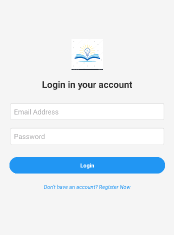
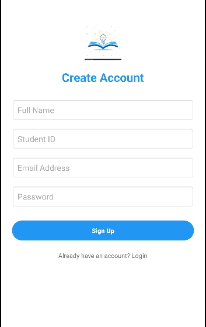
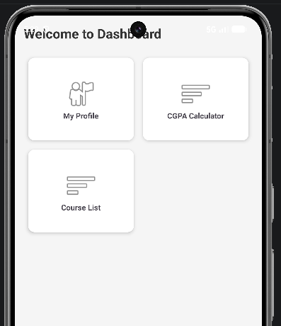
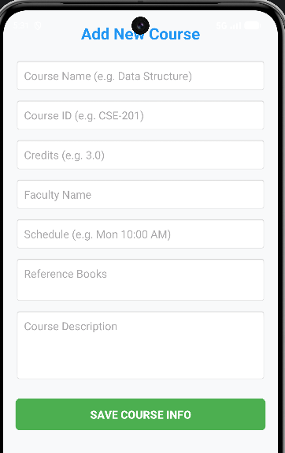
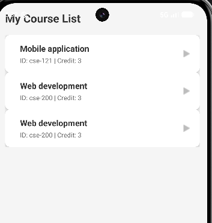
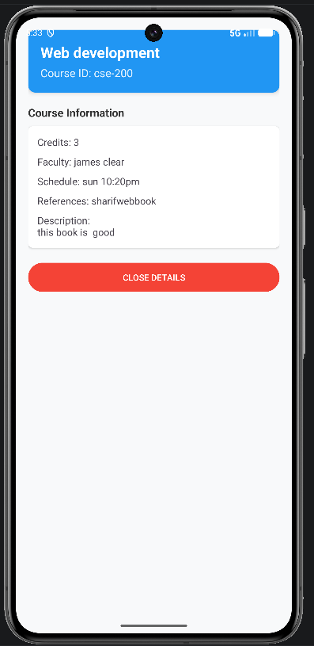
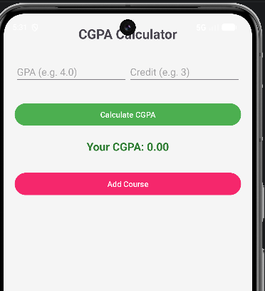
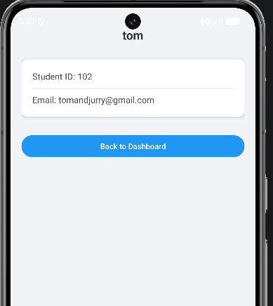

# Smart Learner App 🎓

## 📸 Screenshots

  
  
  

  
  
  

  
  

## ✨ Key Features
- **User Management:** Secure Login & Registration.
- **Course Tracker:** Add and manage academic courses.
- **Detailed View:** View full information for each course.
- **CGPA Calculator:** Smart tool for GPA calculation.
